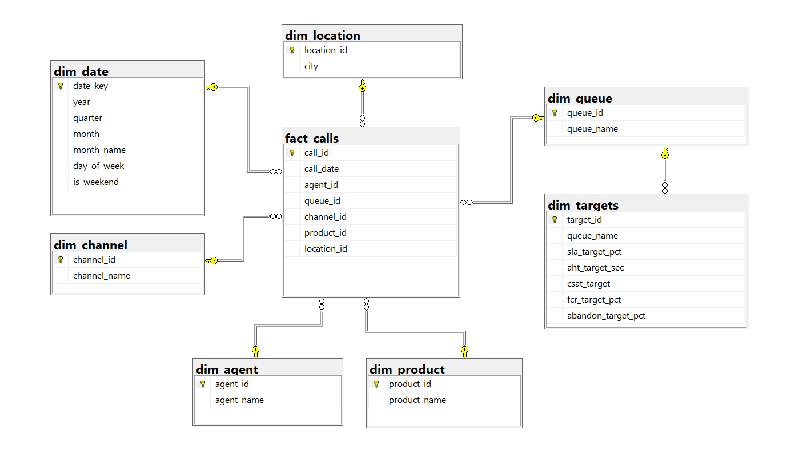

# SQL Project — Call Center Database

A full end-to-end SQL Server project simulating the operational database of a UAE-based
telecom contact centre. Built to demonstrate practical SQL skills applied to a domain
I have worked in for 6+ years across BPO and contact centre environments in Cairo and Dubai.

---

## Files

| File | Description |
|------|-------------|
| `01_database_build.sql` | Schema design, data population, indexes, and data quality checks |
| `02_analysis.sql` | KPI analysis queries, target variance reporting, and stored procedure |

Run `01_database_build.sql` first, then `02_analysis.sql`.

---

## Database Design

**Star schema — 1 fact table, 7 dimension tables, 12,000 call records**

| Table | Description |
|-------|-------------|
| `fact_calls` | One row per call — timestamps, scores, disposition, SLA flag |
| `dim_agent` | 15 agents handling all queue types |
| `dim_queue` | 6 queues: Billing, Cancellations, Customer Service, Sales, Technical Support, Upgrade & Retention |
| `dim_channel` | Phone, Chat, Email, WhatsApp |
| `dim_product` | 6 telecom products: Mobile Plan, Broadband, TV Package, Business Line, IoT Service, Roaming Add-on |
| `dim_location` | 7 UAE cities: Abu Dhabi, Ajman, Al Ain, Dubai, Fujairah, Ras Al Khaimah, Sharjah |
| `dim_date` | Date dimension with UAE weekend flag (Saturday–Sunday, post January 2022) |
| `dim_targets` | Contracted KPI targets per queue for variance analysis |

## Schema Diagram



---

## What the Analysis Covers

**Section 1 — Analysis Queries (Q1–Q8)**

| Query | Focus |
|-------|-------|
| Q1 | Monthly call volume — offered, answered, abandoned — with SLA %, AHT, and average wait time trend |
| Q2 | Agent performance scorecard ranked by CSAT |
| Q3 | Abandon rate by hour of day |
| Q4 | NPS segmentation — Detractors, Passives, and Promoters with Net NPS |
| Q5 | Queue performance comparison — volume, AHT, CSAT, and FCR |
| Q6 | Month-over-month call volume change using LAG window function |
| Q7 | Top 3 agents per queue ranked by CSAT using RANK with PARTITION |
| Q8 | Running YTD call volume by channel using cumulative window function |

**Section 2 — Target vs Actual Variance**

Queue-level variance across SLA, AHT, CSAT, FCR, and Abandon Rate with Met / Missed
status flags. Variance column shows the exact gap against contracted targets.

**Section 3 — Stored Procedure**

`usp_MonthlyPerformanceReport` accepts `@Year` and `@Month` parameters and returns
three result sets:

1. Overall monthly KPI summary — volume, abandon rate, SLA, AHT, CSAT, NPS, FCR
2. Queue breakdown with SLA variance vs contracted target and Met / Missed status flag
3. Top 10 agents ranked by CSAT for the selected month

```sql
EXEC dbo.usp_MonthlyPerformanceReport @Year = 2024, @Month = 6;
```

---

## KPI Definitions

| KPI | Definition |
|-----|------------|
| SLA | Wait time ≤ 20 seconds = Met |
| AHT | Talk time + Hold time + After Call Work. Abandoned calls excluded — handle time = 0 |
| CSAT | Post-call IVR score (1–5). Not recorded for abandoned and voicemail calls — excluded from the calculation automatically via NULL |
| NPS | Net Promoter Score (0–10) recorded per connected call |
| FCR | First call resolution flag. Not recorded for abandoned and voicemail calls — excluded from the calculation automatically via NULL |
| Abandon | Calls where handle, talk, hold, and ACW = 0 and agent = NULL |

---

## SQL Techniques Used

- Star schema design with primary and foreign keys
- CTEs (Common Table Expressions) for multi-step aggregations
- Window functions — `RANK()`, `RANK() OVER (PARTITION BY)`, `LAG()`, cumulative `SUM() OVER()`
- `CASE WHEN` logic for KPI status flags, NPS segmentation, and conditional metric exclusions
- `NULLIF` and `CAST` for safe division and type handling
- Parameterised stored procedure with input validation and `RAISERROR`
- Non-clustered indexes on foreign key columns for query performance
- Data quality checks — NULL detection, orphaned records, duplicate identification,
  out-of-range scores, disposition standardisation, FCR nullification for non-applicable calls

---

## Tools

- SQL Server 2019+
- T-SQL
